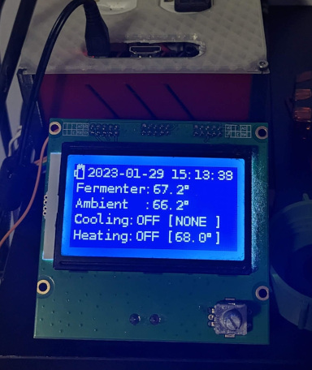

# EG's Brewserver

This is the latest incarnation of my Brewserver. This is the core of the brewserver, that runs on a Raspberry Pi 3b.

This program:
 - reads temperatures (fermenter, ambient) from two Dallas '1-wire' DS18B20 temperature probes via sysfs
 - controls two relays (freezer, heater) via GPIO pins 23 & 24
 - displays status on a repurposed '12864' 3d printer LCD screen (a ST7920) via GPIO SPI
 - provides a simple http web api and status updates via websocket

